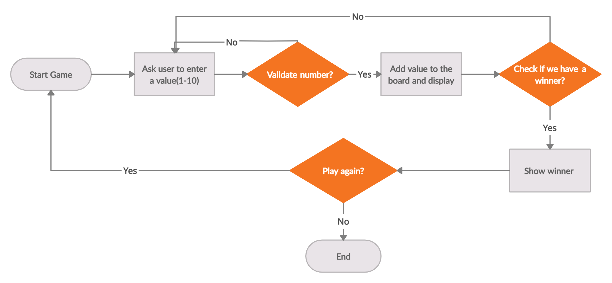

# Tic Tac Toc game
*[Mahshid AM & Yan Chelah]*

*[Ironhack, Paris, 15 November 2020]*

## Content
- [Project Description](#project-description)
- [Game Rules](#rules)
- [Workflow](#workflow)
- [Organization](#organization)
- [Links](#links)

## Project Description
We created a Tic Tac Toe game thanks to Python.This is a one player game against computer, that is played on a 3×3 square grid. Each player occupies a cell in turns, with the objective of placing three marks in a horizontal, vertical, or diagonal pattern.

## Game Rules
The game is played on a grid that's 3 squares by 3 squares.
You are X, your friend is O. Players take turns putting their marks in empty squares.
The first player to get 3 of her marks in a row (up, down, across, or diagonally) is the winner.
When all 9 squares are full, the game is over. If no player has 3 marks in a row, the game ends in a tie. 

## Workflow

## Organization
In repositoy of project you find:

- README.md
- TicTacToe_Mahshid_Yani.ipynb (project file)
- img
  

## Links 

[Repository](https://github.com/mahshidAM/Tic_Tac_Toe)  
